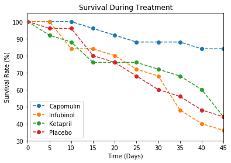

Trend 1: the drug Capomulin can decrease the tumor size.

Trend 2: Capomulin can control tumore spreading better.

Trend 3: Capomulin is more safe because the overall mouse survival rate is higher.


```python
# Dependencies
import matplotlib.pyplot as plt
import numpy as np
import pandas as pd
```


```python
# read both csv files from raw data folder
clinical_df = pd.read_csv('raw_data/clinicaltrial_data.csv')
mouse_df = pd.read_csv('raw_data/mouse_drug_data.csv')
```


```python
# check clinical data frame
clinical_df.head()
clinical_df.shape
# clinical_df.loc[clinical_df['Mouse ID'] == 'g989']
```


    (1893, 4)


```python
# check mouse data frame
mouse_df.head()
mouse_df.shape
# mouse_df.loc[mouse_df['Mouse ID'] == 'g989']
# mouse_df['Drug'].value_counts()
```


    (250, 2)


```python
# combine two data frames
df = pd.merge(clinical_df, mouse_df, on='Mouse ID', how='outer')
df.head()
df.shape
```


    (1906, 5)


```python
# list of drugs interested
drugs = ['Capomulin', 'Infubinol', 'Ketapril', 'Placebo']
```


```python
# generate function to plot tumor change after drug treatment
def Tumor_change_single_drug(change, drug):
    temp_df = df.loc[df['Drug'] == drug]
    new_df = pd.DataFrame(temp_df.groupby('Timepoint')[change].mean())
    new_df.reset_index(inplace = True)
    plt.errorbar(x = new_df['Timepoint'], y = new_df[change],
                 yerr = temp_df.groupby('Timepoint')[change].sem(), 
                 fmt = 'o--', label = drug, elinewidth = 1, capthick = 1, capsize = 5)
```


```python
# plot for tumor size change for drugs interested
for drug in drugs:
    Tumor_change_single_drug('Tumor Volume (mm3)', drug)
plt.title('Tumor Size Response to Treatment')
plt.xlabel('Time (Days)')
plt.ylabel('Tumor Volume (mm3)')
plt.legend(loc = 'best')
plt.xlim(0, 45)
plt.ylim(20, 80)
plt.show()
```


```python
# plot for tumor spreading change for drugs interested
for drug in drugs:
    Tumor_change_single_drug('Metastatic Sites', drug)
plt.title('Metastatic Spread During Treatment')
plt.xlabel('Treatment Duration (Days)')
plt.ylabel('Met. Sites')
plt.legend(loc = 'best')
plt.xlim(0, 45)
plt.ylim(0, 4)
plt.show()
```


```python
# generate function to plot animal survival after drug treatment
def mouse_survival_single_drug(drug):
    temp_df = df.loc[df['Drug'] == drug]
    new_df = pd.DataFrame(temp_df.groupby('Timepoint')['Mouse ID'].count())
    new_df.reset_index(inplace = True)
    plt.plot(new_df['Timepoint'], new_df['Mouse ID']/new_df['Mouse ID'][0]*100,
             'o--', label=drug)
```


```python
# plot for mouse survival for drugs interested
for drug in drugs:
    mouse_survival_single_drug(drug)
plt.title('Survival During Treatment')
plt.xlabel('Time (Days)')
plt.ylabel('Survival Rate (%)')
plt.legend(loc = 'best')
plt.xlim(0, 45)
plt.ylim(30, 105)
plt.show()
```





```python
# generate function to calculate % tumor volume change after 45-day treatment
def percent_tumor_change_single_drug(drug):
    temp_df = df.loc[df['Drug'] == drug]
    new_df = pd.DataFrame(temp_df.groupby('Timepoint')['Tumor Volume (mm3)'].mean())
    new_df.reset_index(inplace = True)
    percent_change = round((new_df.iloc[9,1] - new_df.iloc[0,1])/new_df.iloc[0,1] * 100, 0)
    return percent_change
```


```python
# calculate percent tumor size change for drugs interested
change = []
for drug in drugs:
    change.append(round(percent_tumor_change_single_drug(drug),2))
print(change)
```

    [-19.0, 46.0, 57.0, 51.0]


```python
# generate bar chart showing percent tumor size change
x_axis = np.arange(len(drugs))
plt.bar(x_axis, change, color=['g', 'r', 'r', 'r'], alpha=1, edgecolor = 'black')
tick_locations = [value for value in x_axis]
plt.xticks(tick_locations, drugs)
plt.axhline(y=0, color='black', linestyle='-')
plt.grid(color = 'black', linestyle='--', linewidth=0.1)
plt.text(-0.2, -5, str(change[0])+'%', color = 'w')
for i in range(1, 4):
    plt.text(i-0.2, 5, str(change[i])+'%', color = 'w')
plt.title('Tumor Change Over 45 Day Treatment')
plt.ylabel('% Tumor Volume Change')    
plt.xlim(-0.5, 3.5)
plt.ylim(-20, 60)
plt.tick_params(direction = 'in')
plt.show()
```


```python

```
